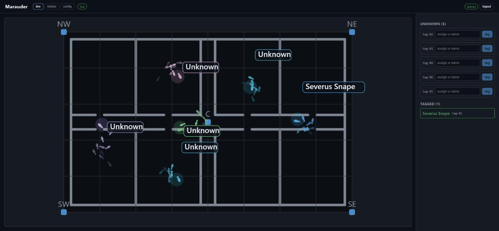

# Marauder

[](https://github.com/mirzanajafov/marauder/actions/workflows/ci.yml)

**Live demo:** https://marauder.169-58-177-61.sslip.io — the map is open to watch; naming people needs the admin password.

Real-time indoor positioning for opt-in tags. I built it to see how far you can
push RSSI-based tracking with a clean streaming pipeline: fixed BLE/Wi-Fi tags
report to fixed receivers, and the backend turns that noisy stream into live dots
moving on a floor plan.

The use case is a workplace: staff and assets moving around a building in real time,
each shown by name on the floor plan. The tracked things carry a tag on purpose —
think a staff badge or an asset tag — not phones tracked without consent.



## How it works

A receiver sees a tag and publishes `{ fingerprint, receiverId, rssi, txPower, ts }`
over MQTT. The API resolves the fingerprint to an entity (creating an "unknown"
one the first time), estimates a position from the RSSI readings across receivers,
and streams batched position updates to the web UI over WebSocket. When a new tag
appears you tag it with a name once; after that it is recognized instantly from a
Redis lookup.

Positions come from a log-distance path-loss model, trilateration when three or
more receivers hear a tag, and an exponential moving average to keep markers from
jumping. History goes into a TimescaleDB hypertable so you can replay a session.

## Stack

- NestJS + TypeScript API
- MQTT (Mosquitto) for signal ingest
- Redis for fingerprint resolution, caching, and Socket.IO scale-out
- JWT auth guarding the write endpoints
- TimescaleDB for position history
- React + Vite map UI
- A simulator that generates realistic noisy receiver traffic, so you can run the
  whole thing without hardware

## Run it

```
docker compose up -d
pnpm install
pnpm --filter api prisma migrate deploy
pnpm dev
```

Then open the web app, watch tags appear as "unknown", and name one. Restart the
simulator and it comes back already named. Tagging and the config tab need the admin
password (`ADMIN_PASSWORD`, see `.env.example`); log in from the top bar.

## Layout

- `apps/api` — NestJS backend
- `apps/simulator` — MQTT traffic generator
- `apps/web` — map + admin UI
- `packages/shared` — shared types

## Real sensors

The map is fed over MQTT, so any receiver that publishes `sensors/<receiverId>/signals`
with `{ fingerprint, receiverId, rssi, txPower }` works — the simulator is just one
source. Two reference receivers live in `hardware/`:

- `hardware/esp32-receiver` — an ESP32 sketch (PlatformIO) that BLE-scans and publishes
  RSSI. Set the wifi, MQTT host and `RECEIVER_ID` at the top, flash three boards placed
  apart, and register them in the config tab.
- `hardware/ble-scanner` — a cross-platform Python scanner for a laptop or Raspberry Pi.
  Install with `pip install -r requirements.txt`, then run
  `MQTT_HOST=... RECEIVER_ID=R1 python scanner.py`.

Use fixed-id BLE beacons (or a phone in beacon mode) as tags; each shows up as unknown
until you name it. Set each receiver's position in the config tab and tune
`PATH_LOSS_EXPONENT` and txPower for your space.
